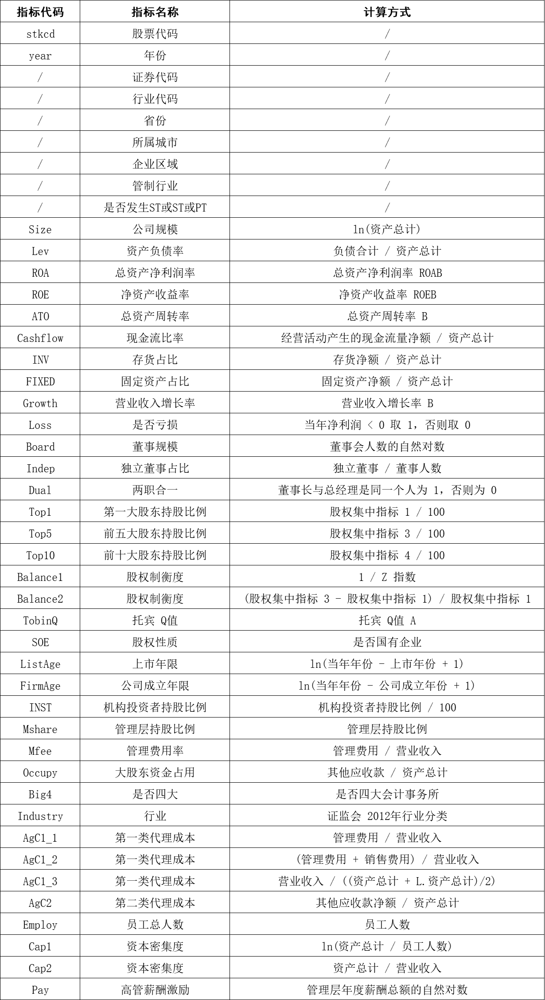
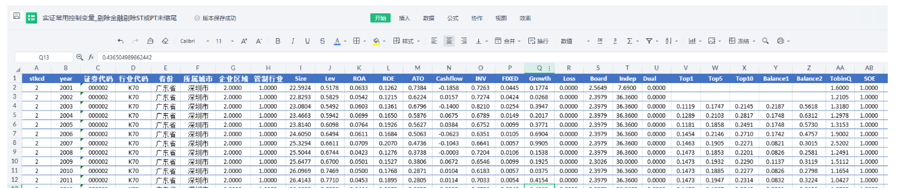

# Instrumental Variables Collection Common Control Variables for Empirical Research in Listed Companies (2001-2024)

717MB
In the modern field of financial research and economics, empirical analysis is a crucial method for understanding economic phenomena, predicting economic trends, and providing theoretical foundations 
for economic decision-making. 
As an essential part of the market, data from listed companies holds high value for researchers. 
When conducting empirical studies on listed companies, researchers often require extensive data for analysis. 
To ensure the accuracy and reliability of the results, the selection of control variables is particularly important. 
Control variables help researchers to control for unrelated disturbances, thereby more accurately identifying the causal relationship between primary variables.
## Images

Here is a pay link on Stripe ( https://buy.stripe.com/3cs8yP7sY87d0vu9AB ). Please contact me lonlonago@foxmail.com after funding $89, and I will send you a complete data files , thank you!

